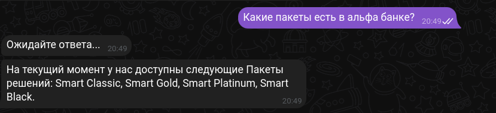

# Custom-Telegram-Bot
Custom telegram bot that was trained on a custom dataset on huggingface. Core model is a FRED-T5-1.7B. So the model can communicate with user only in russian language. To run this project set BOT_TOKEN enviroment variable to your bot token from [BotFather](https://t.me/botfather).Then execute commands below.

```bash
### activate your local python enviroment
pip install -r requirements.txt
python main.py
```

Wait a 10 seconds. If you saw a lines **PEFT model is loaded. Bot is created** everything is OK and you can communicate with your telegram bot.



## Data 
Data for fine tuning was collected from the website of the famous Belarusian and Russian bank named as [Alfa Bank](https://www.alfabank.by/). To train the model, it is necessary to have the data in the form of instructions containing fields **"context"** and **"response"**. If you want to see the example of such data you can follow the [link](https://huggingface.co/datasets/ZhenDOS/alpha_bank_data) that contain the data that model was fine tuned on.

## Model 
The base model is a large language model [FRED-T5-1.7B model from ai-forever user](https://huggingface.co/ai-forever/FRED-T5-1.7B). That model was trained on a larguage corpus of data with dialogues in russian.

## Fine tuning
The model fine tuned on 100 epochs using Nvidia GeForce RTX 3090. The learning process took 2 hours. Example of code for model fune tuning is provided in [FRED_finetune notebook](https://github.com/eugenos-programos/Custom-Telegram-Bot/blob/main/training.ipynb).

